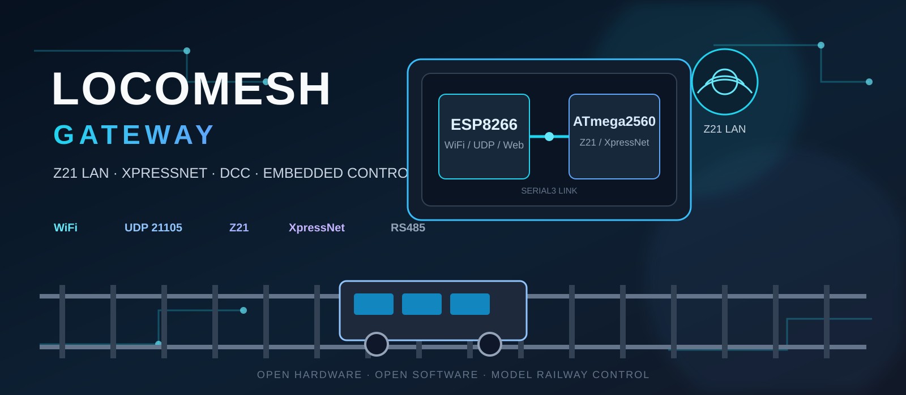

# LocoMesh Gateway



> Z21/XpressNet gateway and emulator built around an ATmega2560 + ESP8266, designed to bridge a Roco MultiMaus with the Z21 LAN protocol.


---

## 📋 Overview

**LocoMesh Gateway** is an open hardware/software project that implements a Z21-compatible network gateway around an **ATmega2560 + ESP8266** board.

The project is designed to sit between:

```text
                    WiFi / Ethernet network
                             │
                             │ Z21 LAN protocol
                             │ UDP : 21105
                             ▼
                    ┌───────────────────┐
                    │     ESP8266       │
                    │                   │
                    │ WiFi AP / STA     │
                    │ UDP server        │
                    │ Web configuration │
                    └─────────┬─────────┘
                              │
                         Serial3
                              │
                              ▼
                    ┌───────────────────┐
                    │    ATmega2560     │
                    │                   │
                    │ Z21 protocol     │
                    │ XpressNet        │
                    │ Traction state   │
                    │ TFT / Encoder    │
                    │ Emergency Stop   │
                    └─────────┬─────────┘
                              │
                         RS485 / XpressNet
                              │
                              ▼
                    ┌───────────────────┐
                    │    Roco          │
                    │    MultiMaus      │
                    │                   │
                    │ XpressNet master  │
                    │ + booster         │
                    └─────────┬─────────┘
                              │
                              ▼
                         DCC railway
```

The initial target is to make the system behave as a **Z21-compatible network device** while using the existing MultiMaus/XpressNet infrastructure to control the railway.

The architecture is deliberately designed so that the traction backend can evolve independently from the Z21 network layer.

---

## 🎯 Project Goals

The project has three main goals:

1. **Implement the Z21 LAN protocol** on an ESP8266 + ATmega2560 platform.
2. **Bridge Z21 LAN and XpressNet**, using a Roco MultiMaus as the existing XpressNet master and DCC booster.
3. Provide a hardware platform that can eventually evolve into a more complete standalone digital railway controller.

The long-term architecture is intended to support several possible traction backends:

```text
                    ┌─────────────────────┐
                    │     Z21 LAN Core    │
                    └──────────┬──────────┘
                               │
                    Traction Backend API
                               │
             ┌─────────────────┼─────────────────┐
             │                 │                 │
             ▼                 ▼                 ▼
        XpressNet           LocoNet          DCC Direct
          v1                  v2                 v3
```

---

## ✨ Features

### Z21 network interface

- Z21 LAN protocol over UDP.
- Default Z21 UDP port: `21105`.
- Compatible architecture for Z21 clients such as control applications.
- Device identification and hardware information.
- System state handling.
- Track power control.
- Locomotive control.
- Locomotive functions.
- Emergency stop.
- Broadcast configuration.
- Firmware/version information.
- Accessory control.

### XpressNet

The ATmega2560 acts as the protocol core and communicates with the existing Roco MultiMaus infrastructure through XpressNet.

Supported/planned functionality includes:

- Locomotive control.
- 14/28/128 speed steps.
- F0–F28 functions.
- Track power state.
- Emergency stop.
- Accessory control.
- CV programming.
- XpressNet status handling.

### WiFi

The ESP8266 provides:

- WiFi station mode.
- Automatic fallback to access-point mode.
- Z21 UDP server.
- Web configuration interface.
- Connection/status information.
- Diagnostics between the ESP8266 and ATmega2560.

When the configured WiFi network cannot be reached, the gateway can fall back to its own AP.

---

## 🧩 Hardware Architecture

### Main controller

The current target hardware is a **Mega + WiFi R3** board based on:

- ATmega2560
- ESP8266
- 32 MB flash
- CH340G USB interface
- DIP-switch based MCU/ESP routing

### Hardware responsibilities

| Component | Responsibility |
| --- | --- |
| ESP8266 | WiFi, UDP, web server and network-facing Z21 interface |
| ATmega2560 | Protocol core, XpressNet, state management and local UI |
| Serial3 | ESP8266 ↔ ATmega2560 communication |
| Serial0 | USB programming/debugging |
| Serial1/2 | Candidate interfaces for XpressNet RS485 |
| MAX485/MAX481 | RS485 transceiver |
| TFT shield | Local status/control UI |
| Rotary encoder | Local navigation |
| E-stop | Hardware emergency stop |
| MultiMaus | XpressNet master and existing DCC infrastructure |

---

## 🔌 ESP8266 ↔ ATmega2560

The connection between the two processors uses **Serial3**.

The design intentionally leaves `Serial0` available for USB debugging.

The internal protocol uses a small framing layer:

```text
┌──────────┬──────────┬──────────────────┐
│ TYPE     │ LENGTH   │ PAYLOAD          │
│ 1 byte   │ 1 byte   │ variable         │
└──────────┴──────────┴──────────────────┘
```

`TYPE` distinguishes normal Z21 data from internal diagnostic messages such as the heartbeat.

This prevents diagnostic traffic from accidentally being forwarded to the WiFi interface.

---

## ❤️ Heartbeat & Watchdog

The internal link includes a diagnostic heartbeat.

The ATmega2560 periodically reports information such as:

- Uptime.
- Average loop time.
- Maximum loop time.
- Available RAM.
- Number of valid Z21 frames.
- Number of invalid frames.

The ESP8266 can therefore distinguish between:

```text
No Z21 client
        ≠
ESP8266 problem
        ≠
ATmega2560 problem
        ≠
Protocol problem
```

The ATmega2560 also uses a hardware watchdog.

The current watchdog timeout is **4 seconds**, allowing the controller to recover automatically if the main loop becomes stuck.

---

## 🚂 Locomotive State

The core maintains state for active locomotives including:

- Address.
- Speed.
- Direction.
- Speed-step format.
- Functions F0–F28.

The design is intended to support multiple simultaneously active locomotives while remaining within the limited RAM available on the ATmega2560.

---

## 🚦 Accessories

Accessories use a common internal representation.

At the Z21 protocol level, devices such as:

- Turnouts.
- Two-aspect signals.
- Uncouplers.
- Bistable derailers.

can be represented as two-output DCC accessories.

The internal model therefore stores:

```text
AccessoryState
├── address
└── position
    ├── unknown
    ├── output 1
    └── output 2
```

The current implementation includes the foundation for:

- `LAN_X_GET_TURNOUT_INFO`
- `LAN_X_SET_TURNOUT`
- `LAN_X_TURNOUT_INFO`

Extended multi-aspect signals require the separate Z21 extended-accessory protocol and remain outside the current basic accessory implementation.

---

## 📡 WiFi Modes

The ESP8266 normally starts in **station mode** and attempts to connect to the configured network.

If the connection cannot be established, the firmware can fall back to an independent access point.

```text
                    ┌───────────────┐
                    │   ESP8266     │
                    └───────┬───────┘
                            │
                 ┌──────────┴──────────┐
                 │                     │
              STA mode              AP mode
                 │                     │
                 ▼                     ▼
          Home network           Z21_XXXXXX
```

The gateway exposes the Z21 UDP server in both modes.

---

## 🌐 Web Configuration

The ESP8266 hosts a lightweight configuration interface.

The interface is intended to provide:

- WiFi configuration.
- Current operating mode.
- IP address.
- RSSI.
- Connected Z21 clients.
- XpressNet configuration.
- ESP ↔ Mega communication status.
- Restart/apply configuration operations.

The web interface is also used for diagnostics without occupying the USB serial interface.

---

## 🔎 Protocol Sniffer

A protocol sniffer is planned for debugging communication between:

```text
Z21 LAN
   │
   ▼
ESP8266
   │
   ▼
ATmega2560
   │
   ▼
XpressNet
```

The sniffer is intentionally **not permanently active**.

It can capture:

- Z21 UDP traffic.
- XpressNet traffic.
- Direction.
- Relative timestamp.
- Raw hexadecimal payload.

Example:

```text
[12.345s] Z21 → DataLen=0x08 Header=0x40
           Data=[A2 00 00 A2]
```

The diagnostic output is designed to be exposed through the web interface using WebSocket communication rather than blocking the real-time control loop.

---

## 🖥️ Local Interface

The planned local UI uses a:

- 3.5" TFT LCD shield.
- Parallel 8-bit interface.
- `MCUFRIEND_kbv`.
- Rotary encoder.
- Encoder push button.
- Dedicated emergency-stop button.
- MicroSD storage.

The local interface is intended to provide:

- Locomotive control.
- Accessory control.
- Device configuration.
- WiFi status.
- Track power status.
- Current/voltage information where available.
- Sniffer status.
- Local data/log storage.

The emergency stop is designed as a hardware interrupt so that it does not depend on the normal UI loop.

---

## 🧱 Software Architecture

The project separates the network protocol from the physical traction backend.

Conceptually:

```text
┌───────────────────────────────────────────┐
│              Z21 LAN Layer                │
│                                           │
│ UDP / clients / broadcasts / state        │
└─────────────────────┬─────────────────────┘
                      │
                      ▼
┌───────────────────────────────────────────┐
│          Traction Abstraction             │
│                                           │
│ locomotives / accessories / track state   │
└───────────────┬───────────────┬───────────┘
                │               │
                ▼               ▼
        ┌──────────────┐ ┌──────────────┐
        │  XpressNet   │ │   Future     │
        │   Backend    │ │   Backends   │
        └──────────────┘ └──────────────┘
```

This separation is important because the project is not intended to permanently couple the Z21 implementation to one particular railway bus.

---

## 🛣️ Roadmap

### Phase 1 — XpressNet gateway

- Mega + ESP hardware selected.
- ESP ↔ Mega communication design.
- Serial3 communication strategy.
- WiFi STA/AP architecture.
- Z21 UDP architecture.
- Heartbeat design.
- Watchdog design.
- Basic accessory model.
- Complete minimum Z21 identification handshake.
- Validate recognition with the official Z21 application.
- Complete XpressNet traction backend.
- Validate against real MultiMaus hardware.

### Phase 2 — Extended functionality

- CV read/write.
- Extended accessories.
- Protocol sniffer.
- Local TFT interface.
- SD logging.
- Improved diagnostics.
- Additional Z21 commands.

### Phase 3 — Additional backends

- LocoNet backend.
- LocoNet hardware interface.
- Occupancy detection support.

### Phase 4 — Standalone digital command station

Long-term experimentation may allow the hardware to operate without relying on the existing MultiMaus booster:

```text
Z21 LAN
   │
   ▼
ATmega2560
   │
   ▼
DCC generator
   │
   ▼
Booster
   │
   ▼
Railway
```

This would turn the gateway architecture into the basis of a complete standalone digital command station.

---

## 📁 Repository Structure

```text
LocoMesh-GateWay/
│
├── README.md
├── AGENT.md
│
├── docs/
│   └── Z21_EMULATOR_SPEC.md
│
├── src/
│   ├── esp8266_wifi/
│   │   └── WiFi / UDP / Web / diagnostics
│   │
│   ├── mega_z21/
│   │   └── Z21 core / XpressNet / UI
│   │
│   └── shared/
│       └── Shared protocol definitions
│
└── gerber/
    └── PCB manufacturing files
```

The `gerber/` directory is reserved for the future PCB/shield design.

---

## 🔬 Technical Notes

### Z21 recognition

One of the most important development milestones is compatibility with the official Z21 application.

The initial MVP therefore prioritises the minimum identification sequence before implementing the complete railway control stack.

The relevant commands include:

- `LAN_GET_SERIAL_NUMBER`
- `LAN_GET_HWINFO`
- `LAN_X_GET_VERSION`
- `LAN_X_GET_STATUS`
- `LAN_GET_CODE`

The responses must be mutually consistent rather than simply returning valid individual packets.

### RAM constraints

The ATmega2560 has significantly more SRAM than the original Arduino Uno architecture for which some of the historical reference implementations were designed.

This provides room for maintaining:

- Multiple locomotive states.
- Accessory states.
- Protocol buffers.
- Diagnostic counters.
- UI state.

Nevertheless, memory use remains an explicit design constraint.

---

## 📚 References

The project builds on publicly documented protocols and existing open-source implementations.

Relevant references include:

- **Digital-MoBa/DCCInterfaceMaster** — reference implementation for Arduino Z21/DCC functionality.
- **tkoning/Z21-arduino** — reference for Z21/XpressNet integration with Roco hardware.
- Z21 LAN protocol documentation.
- XpressNet documentation.

External projects remain subject to their own licenses and attribution requirements.

---

## ⚠️ Current Limitations

This project is **experimental hardware/software**.

In particular:

- Not all Z21 commands are implemented.
- Real hardware validation is still required for parts of the XpressNet backend.
- Extended accessory support is incomplete.
- The LocoNet backend is future work.
- Direct DCC generation is future work.
- The exact RS485 interface/pin assignment still needs final hardware validation.
- The TFT/encoder pin mapping must be checked against all serial interfaces.

Do not treat the current implementation as a replacement for a production Z21 command station.

---

## 📌 Project Status

### 🟢 ACTIVE — Development

The project is actively being developed as an experimental open hardware/software railway-control platform.

The current milestone is the **Z21-compatible XpressNet gateway**.

---

## 📸 Media

Project images and hardware photographs will be stored under:

```text
docs/images/
```

Planned visual documentation includes:

- Hardware overview.
- Wiring diagram.
- Mega ↔ ESP communication.
- XpressNet connection.
- TFT interface.
- Protocol flow.
- Final assembled gateway.

---

## 🤝 Contributing

The project is primarily developed as a personal engineering and research project.

Issues, technical feedback and improvements are welcome, particularly around:

- Z21 protocol compatibility.
- XpressNet behaviour.
- Embedded timing.
- Hardware interfacing.
- Railway digital protocols.

---

## 📄 License

See the repository for the applicable license information.

External libraries and reference implementations retain their original licenses and attribution.

---

## 👤 Author

**Mario Rubio Ávila — mrubiodev**

Software engineer, maker and independent developer.

- GitHub: https://github.com/mrubiodev
- Website: https://mrubiodev.com
- Blog: https://blog.mrubiodev.com

---

> **LocoMesh Gateway** — connecting model railways, protocols and hardware.
